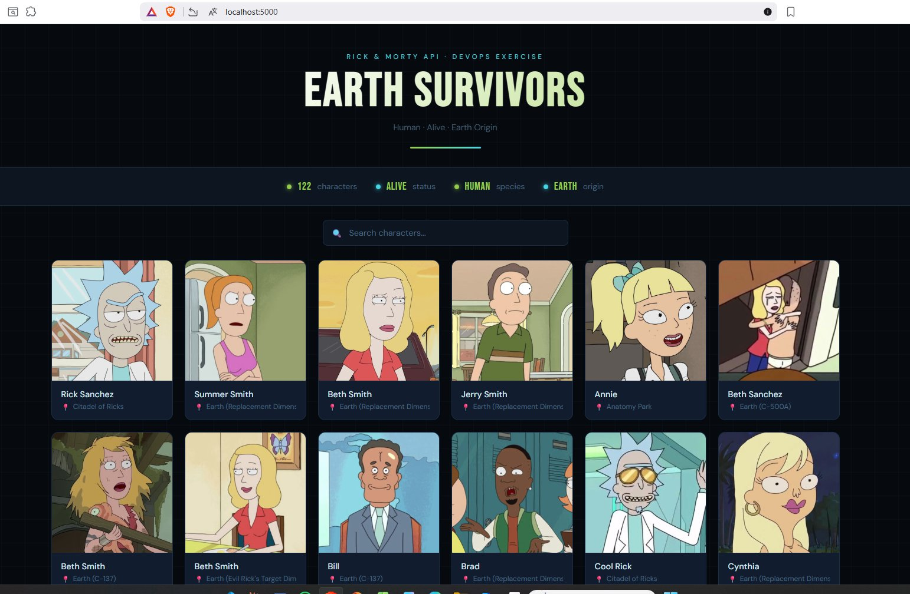
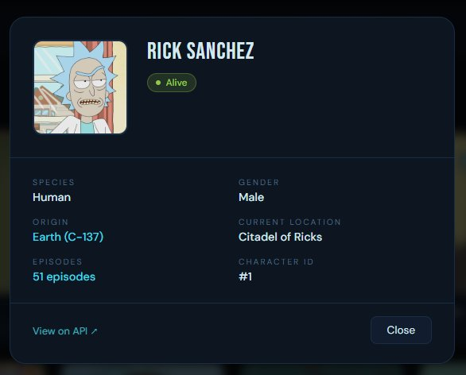
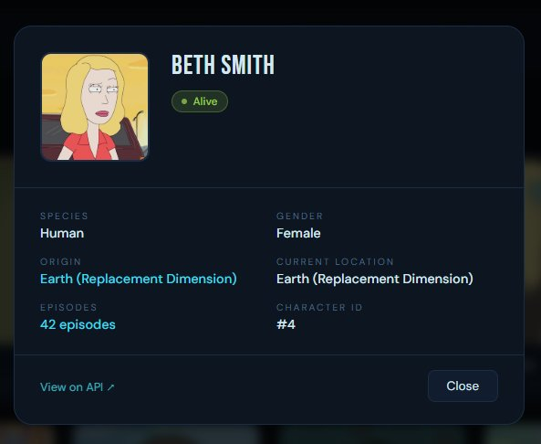

# Rick and Morty DevOps

A REST API service that fetches and exposes Rick and Morty characters filtered by species, status, and origin — packaged with Docker, Kubernetes, Helm, and a full CI/CD pipeline.

---

## Screenshots

### Dashboard


### Character Modal – Rick Sanchez


### Character Modal – Beth Smith


---

## Table of Contents

- [Overview](#overview)
- [Project Structure](#project-structure)
- [Running Locally](#running-locally)
- [REST API Endpoints](#rest-api-endpoints)
- [Docker](#docker)
- [Kubernetes](#kubernetes)
- [Helm](#helm)
- [GitHub Actions](#github-actions)

---

## Overview

This service queries the [Rick and Morty API](https://rickandmortyapi.com/documentation/#rest) and returns all characters that meet the following criteria:

- **Species:** Human
- **Status:** Alive
- **Origin:** Contains "Earth"

Results are available as a CSV file (`characters.csv`) and via REST API endpoints.

---

## Project Structure

```
rick-morty-devops/
├── app.py                        # Flask REST API
├── fetch_characters.py           # Data fetching and filtering logic
├── requirements.txt              # Python dependencies
├── Dockerfile                    # Docker image definition
├── characters.csv                # Generated output file
├── yamls/
│   ├── Deployment.yaml
│   ├── Service.yaml
│   └── Ingress.yaml
├── helm/
│   ├── Chart.yaml
│   ├── values.yaml
│   └── templates/
│       ├── Deployment.yaml
│       ├── Service.yaml
│       └── Ingress.yaml
└── .github/
    └── workflows/
        └── ci.yml
```

---

## Running Locally

### Prerequisites

- Python 3.11+

### Install dependencies

```bash
pip install -r requirements.txt
```

### Generate CSV file

```bash
python fetch_characters.py
```

Output: `characters.csv` with columns `Name`, `Location`, `Image`.

### Start the API server

```bash
python app.py
```

Server runs at `http://localhost:5000`.

---

## REST API Endpoints

| Method | Endpoint | Description |
|--------|----------|-------------|
| GET | `/` | Interactive HTML dashboard with character cards |
| GET | `/healthcheck` | Returns service health status |
| GET | `/characters` | Returns all filtered characters as JSON |

### Example responses

**GET /healthcheck**
```json
{
  "status": "ok"
}
```

**GET /characters**
```json
{
  "count": 122,
  "characters": [
    {
      "name": "Rick Sanchez",
      "location": "Earth",
      "image": "https://rickandmortyapi.com/api/character/avatar/1.jpeg"
    }
  ]
}
```

---

## Docker

### Prerequisites

- [Docker Desktop](https://www.docker.com/products/docker-desktop/)

### Build the image

```bash
docker build -t rick-morty-devops .
```

### Run the container

```bash
docker run -p 5000:5000 rick-morty-devops
```

The API is available at `http://localhost:5000`.

---

## Kubernetes

### Prerequisites

- [minikube](https://minikube.sigs.k8s.io/docs/start/) or [microk8s](https://microk8s.io/)
- [kubectl](https://kubernetes.io/docs/tasks/tools/)

### Setup

```bash
# Start minikube
minikube start

# Load the Docker image into minikube
minikube image load rick-morty-devops:latest

# Enable the ingress addon
minikube addons enable ingress
```

### Deploy

```bash
kubectl apply -f yamls/
```

### Verify

```bash
kubectl get pods
kubectl get services
```

### Access the service

```bash
minikube service rick-morty-devops
```

Or via NodePort at `http://<minikube-ip>:30500`.

### Teardown

```bash
kubectl delete -f yamls/
```

---

## Helm

### Prerequisites

- [Helm v3](https://helm.sh/docs/intro/install/)

### Install

```bash
helm install rick-morty helm/
```

### Verify

```bash
helm list
kubectl get pods
```

### Upgrade

```bash
helm upgrade rick-morty helm/
```

### Uninstall

```bash
helm uninstall rick-morty
```

### Configuration

Key values in `helm/values.yaml`:

| Key | Default | Description |
|-----|---------|-------------|
| `replicaCount` | `2` | Number of pod replicas |
| `image.name` | `rick-morty-devops` | Docker image name |
| `image.tag` | `latest` | Docker image tag |
| `service.nodePort` | `30500` | NodePort for external access |
| `ingress.enabled` | `true` | Enable/disable ingress |
| `ingress.host` | `rick-morty.local` | Ingress hostname |

Override values at install time:

```bash
helm install rick-morty helm/ --set replicaCount=3
```

---

## GitHub Actions

The CI/CD pipeline is defined in `.github/workflows/ci.yml` and triggers on every push or pull request to `main`.

### Workflow jobs and steps

| Step | Description |
|------|-------------|
| Checkout repository | Clones the source code |
| Start k3s cluster | Spins up a lightweight Kubernetes cluster on the runner |
| Build Docker image | Builds the image from the Dockerfile |
| Import image into k3s | Loads the image into the k3s containerd runtime via `docker exec` |
| Deploy to Kubernetes | Applies all manifests from `yamls/` |
| Wait for deployment | Waits up to 180s for all pods to become ready |
| Run smoke tests | Tests `/healthcheck` and `/characters` endpoints via `curl` |

### Smoke test checks

- `GET /healthcheck` must return `{"status": "ok"}`
- `GET /characters` must return a JSON object containing a `"characters"` array
